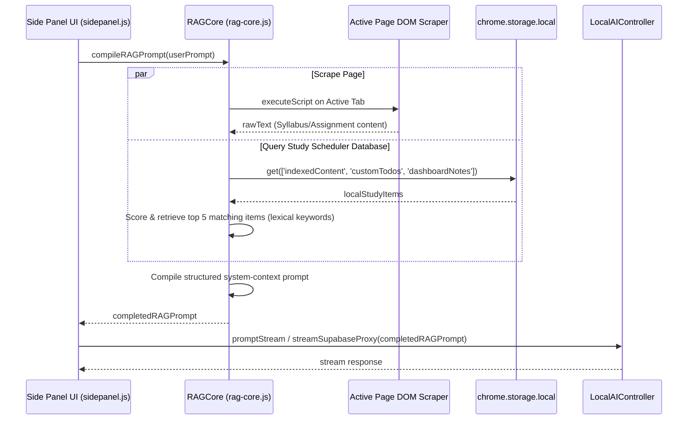

# Canvascope v8 Phase 2: Dual-Source RAG Context Pipeline

This plan outlines the architecture, implementation steps, and verification procedures to deliver **Phase 2 (Dual-Source RAG Context Pipeline)** of the Canvascope v8 study companion update. 

This update links the AI assistant (both offline Gemini Nano and online Supabase Fallback) to Canvascope's local knowledge base. It will retrieve relevant items (assignments, user to-dos, and memo notes) using a localized keyword scorer and combine them with scraped active-page context to formulate context-aware answers.

---

## Technical Architecture & Retrieval Data Flow

---

## User Review Required

> [!IMPORTANT]
> - **LMS Scripting Permissions**: The RAG pipeline relies on the `chrome.scripting` API to scan the student's active Canvas/Blackboard/Brightspace tab. Ensure that you have accepted permissions for active tab scanning if prompted.
> - **Zero External Calls for Retrieval**: The lexical keyword indexing and database scoring occur 100% locally on the client's machine, keeping the student's personal calendar, notes, and study schedule strictly private.

---

## Proposed Changes

We group the developments into two components: the core RAG retrieval engine and its sidepanel frontend integration.

---

### 1. The RAG Core Engine

#### [NEW] [rag-core.js](file:///Users/noelsason/Desktop/Canvascope%20Inc./02-Subsidiaries/canvascope-extension/app/extension-core/v8/rag-core.js)
- Implement a pure JavaScript RAG class `RAGCore` with the following methods:
  - `scrapeActiveTab()`: Queries the active tab, detects LMS domain suitability, and executes a clean DOM scraper returning up to 4,000 characters of page content.
  - `retrieveLocalContext(promptText)`: Extracts searchable assignments, tasks, and memo notes from local storage. Tokenizes the user's question, performs keyword frequency scoring, and retrieves the top 5 most relevant database entries.
  - `compileRAGPrompt(promptText)`: Co-runs the page scraper and local scheduler database retriever, compiles matches into a clean markdown-based context schema, and appends the user's prompt query.

---

### 2. Side Panel Controller Integration

#### [MODIFY] [sidepanel.js](file:///Users/noelsason/Desktop/Canvascope%20Inc./02-Subsidiaries/canvascope-extension/app/extension-core/v8/sidepanel.js)
- Import/Load `rag-core.js` into the execution scope.
- In `handleSubmit()`:
  - Replace the old basic scraping routine with a call to `RAGCore.compileRAGPrompt(prompt)`.
  - Pass the compiled prompt to the local model stream or Supabase fallback stream.

#### [MODIFY] [sidepanel.html](file:///Users/noelsason/Desktop/Canvascope%20Inc./02-Subsidiaries/canvascope-extension/app/extension-core/v8/sidepanel.html)
- Add `` to the header scripts list.

---

## Verification & Testing Plan

### Automated Tests
- Run `npm run test:node` to guarantee that existing search engines and temporal trackers suffer zero regressions.

### Manual Verification
1. Open the Canvascope Side Panel on a standard LMS Assignment page (Canvas).
2. Ask a question referencing local scheduler details (e.g. *"What assignments do I have coming up?"* or *"When is Homework 10 due?"*).
3. Confirm that the AI retrieves matches from both the active page and your Canvascope study list and answers correctly.
4. Verify that formatting (headers, bullet points) renders beautifully in the chat interface.

---

## Phase 2.1 Fixes — `/todo` + Context-Aware Retrieval

Follow-up patch that closed the gap between adding tasks and retrieving them in chat.

### Problems addressed
1. **Retrieval was keyword-only.** Generic questions ("what's on my to-do list?", "what do I need to do?") did not lexically match a to-do titled *"Finish reading bio paper"*, so the side panel returned no context. The RAG was not context-aware.
2. **`/todo` list mode silently broke.** `cmdTodo`'s default/list branch returned a `Promise`, but the overlay's `buildCommandResults` only accepts arrays (`Array.isArray(promise) === false`), so `/todo` and `/todo done <id>` rendered nothing.
3. **Saves failed silently.** `saveArray` swallowed all storage errors and `/todo add` always showed *"Todo added ✓"*, even when the write failed (the usual cause: a content script detached by an extension reload, before the page is refreshed).

### Changes
- **[`v8/rag-core.js`]** Added `hasScheduleIntent()`, `buildCorpus()`, and `getUpcomingItems()`. `retrieveLocalContext()` now returns precise keyword matches when they exist, and **falls back to surfacing pending to-dos + upcoming assignments (sorted by due date)** when the query has schedule intent but no keyword hit. `compileRAGPrompt()` emits a dedicated *"THE STUDENT'S TASKS & DEADLINES"* section and an explicit "list is empty" hint when nothing is stored.
- **[`academic-tools.js`]** `saveArray()` now returns a success boolean and logs failures; `addTodo()` returns `null` when the write fails.
- **[`slash-commands-pack.js`]** `/todo add` reports real success/failure (and recovery instructions on failure); `/todo` list mode reads synchronously from preloaded `ctx.customTodos` and confirms done-toggles.
- **[`slash-overlay.js`]** Preloads `customTodos` on overlay open and exposes it through `getSlashContext()`.
- **[`tests/rag-core.test.mjs`]** +4 tests covering schedule-intent detection, the context-aware fallback, keyword precision still winning, and the tasks section in the compiled prompt. **29/29 node tests pass.**

### ⚠️ Activation step (manual, one-time)
Content-script changes (`/todo`) only take effect after a full extension reload **and** a page refresh:
1. `chrome://extensions` → **Reload** the Canvascope card.
2. **Refresh** any open LMS tab (this reconnects the content scripts to `chrome.storage`).
3. Re-open the Side Panel.
