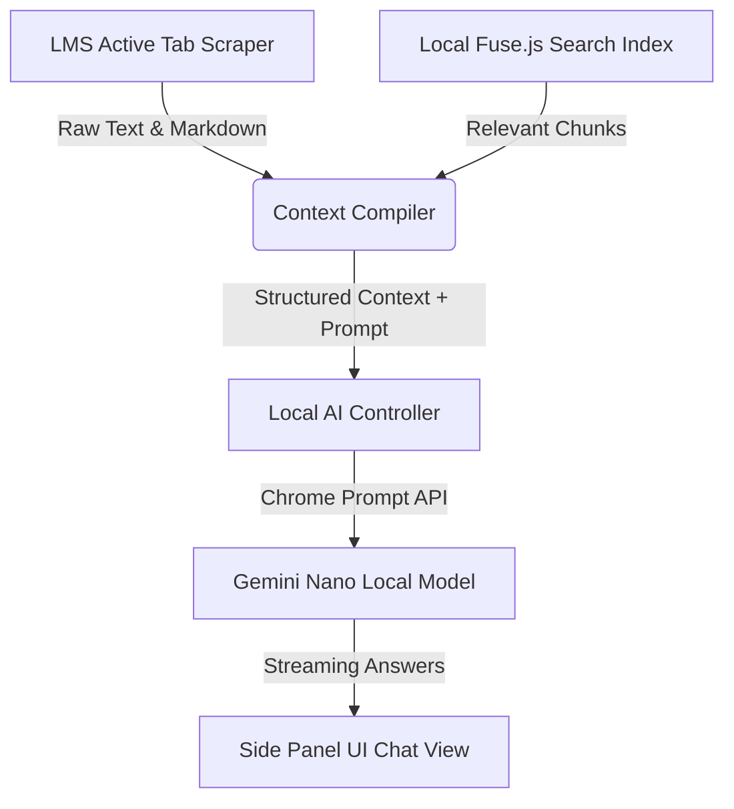

# Canvascope v8.0.0 Major Update - Local AI & RAG Workspace Plan

This implementation plan outlines the architecture, design, and step-by-step phases to deliver the major **v8.0.0** release of Canvascope. 

This update transforms Canvascope from a local-first search bar into a **comprehensive local AI study companion**. It leverages Chrome's built-in **Prompt API (Gemini Nano)** for offline AI processing, establishes a persistent, responsive **Chrome Side Panel** workspace, integrates localized **RAG (Retrieval-Augmented Generation)** using the active page context and Fuse.js, adds **automated AI due-date extraction**, and introduces **in-browser PDF text extraction/indexing**.

---

## Technical Architecture Overview

The v8 companion architecture consists of three interconnected layers running entirely local-first inside the Chrome Extension sandbox:



1. **User Interface (`sidepanel.html` / `sidepanel.js`)**:
   - A beautiful modern side panel with glassmorphism, responsive panels, fluid animations, and high-contrast dark modes matching Canvascope's premium design aesthetics.
   - Contains a Chat Workspace, an Interactive Planner sync drawer, and a PDF text extractor dropzone.
2. **Context Compilation Engine (`rag-core.js`)**:
   - **Active Page Scraper**: Parses the active tab's DOM to extract assignment prompts, quiz descriptions, syllabus tables, and discussion content.
   - **Lexical Filter**: Queries the local Fuse.js index using key terms from the student's question to pull up relevant syllabus rules or calendar entries.
   - **Context Compiler**: Compiles active context and semantic search matches into a prompt format that respects Gemini Nano's local token limits.
3. **Local AI Coordinator (`local-ai.js`)**:
   - Handles Prompt API feature detection, bootstrapping, model parameters, and streams responses directly to the chat window to minimize perceived latency.
4. **PDF Extractor & Parser (`pdf-parser.js`)**:
   - Uses a clientside parser to extract raw text content from slides, lecture decks, and syllabus files, making them searchable via Fuse.js and readable by the local AI context compiler.

---

## Detailed Implementation Phases

We break the v8 roadmap into **four logical phases** designed to be implemented, tested, and released incrementally over a couple of weeks.

### Phase 1: Side Panel Workspace & Chrome Prompt API Integration (Days 1–4)
Focuses on establishing the extension side panel infrastructure and creating a robust link to Chrome's local Gemini Nano model.

#### [NEW] [sidepanel.html](file:///Users/noelsason/Desktop/Canvascope%20Inc./02-Subsidiaries/canvascope-extension/app/extension-core/v8/sidepanel.html)
- Create a premium, responsive side panel layout containing:
  - Header: Course select dropdown and AI Model status indicator.
  - Chat Area: Streaming speech bubble logs, load spinners, and markdown parser.
  - Input Area: Quick-action prompt suggestions (e.g., *"Summarize this page"*, *"List key dates"*, *"Generate practice questions"*).

#### [NEW] [sidepanel.css](file:///Users/noelsason/Desktop/Canvascope%20Inc./02-Subsidiaries/canvascope-extension/app/extension-core/v8/sidepanel.css)
- Implement custom vanilla CSS design systems with glassmorphic backdrops, glowing accents, transition animations, and dark modes synced to active skins.

#### [NEW] [local-ai.js](file:///Users/noelsason/Desktop/Canvascope%20Inc./02-Subsidiaries/canvascope-extension/app/extension-core/v8/local-ai.js)
- Implements Prompt API management:
  - Checks model availability via `ai.languageModel.capabilities()`.
  - Configures optimal settings: temperature, topK, and token caps.
  - Creates active session instances and handles response streaming.

#### [MODIFY] [manifest.json](file:///Users/noelsason/Desktop/Canvascope%20Inc./02-Subsidiaries/canvascope-extension/app/extension-core/manifest.json)
- Add the `"sidePanel"` permission and declare `"side_panel": { "default_path": "v8/sidepanel.html" }`.

---

### Phase 2: Dual-Source RAG Context Pipeline (Days 5–8)
Connects the local AI model to active course details, matching the student's prompt with real-time LMS data.

#### [NEW] [rag-core.js](file:///Users/noelsason/Desktop/Canvascope%20Inc./02-Subsidiaries/canvascope-extension/app/extension-core/v8/rag-core.js)
- **Active Tab Scraper**: Uses `chrome.scripting.executeScript` to extract clean text blocks from the student's active Canvas/Brightspace tab.
- **RAG Compiler**: Compiles the scraped page text and the top 5 Fuse.js search query matches into a compact system context prompt:
  ```markdown
  You are an offline academic study assistant for Canvascope.
  Answer the student's question using the active page context and course materials provided below.
  
  === ACTIVE PAGE CONTEXT ===
  [scraped page text]
  
  === RELEVANT COURSE MATERIAL ===
  [Fuse.js search results]
  ```

---

### Phase 3: PDF text extraction & local indexing (Days 9–11)
Expands the local-first search corpus by allowing students to parse slides, documents, and syllabi locally.

#### [NEW] [pdf-parser.js](file:///Users/noelsason/Desktop/Canvascope%20Inc./02-Subsidiaries/canvascope-extension/app/extension-core/v8/pdf-parser.js)
- Incorporates a pure-JavaScript clientside PDF text extractor inside the side panel window.
- Parses dropped or selected course files and splits text into structured slide/page chunks.
- Automatically inserts these extracted text chunks into `chrome.storage.local` under the specific course, making them immediately searchable in Cmd+K and accessible via the RAG pipeline.

---

### Phase 4: Local AI Due-Date Generator & Planner Automation (Days 12–14)
Closes the loop between the AI assistant and the Canvascope planner by automating task entries.

#### [NEW] [planner-ai.js](file:///Users/noelsason/Desktop/Canvascope%20Inc./02-Subsidiaries/canvascope-extension/app/extension-core/v8/planner-ai.js)
- Prompts the local AI model to parse unstructured text (e.g., a syllabus schedule or list of assignments) and output a clean JSON array of due dates.
- Example JSON output:
  ```json
  [
    { "title": "Homework 4", "dueDate": "2026-05-28T23:59:00", "weight": "10%" },
    { "title": "Midterm Exam", "dueDate": "2026-06-02T10:00:00", "weight": "25%" }
  ]
  ```
- Automatically registers these extracted tasks into Canvascope's existing planner model, notifying the user when their schedule has been synchronized.

---

## Verification & Testing Plan

### 1. Prompt API Integrity
- Run capability checks on various Chrome versions to verify that fallback warnings appear clearly if Gemini Nano is not enabled in the user's browser.
- Measure AI response streaming latency (target: first token in < 150ms).

### 2. RAG Accuracy & Token Caps
- Test RAG prompts against long syllabi (10k+ words) to ensure text chunk truncation handles token caps gracefully.
- Validate that the assistant answers questions using page-specific information (e.g., specific instructions from the active assignment page).

### 3. PDF Extraction & Indexing
- Load complex multi-column academic PDFs and check if structural text chunks parse cleanly.
- Verify that parsed PDF content is successfully indexed and returned in Cmd+K search results.
